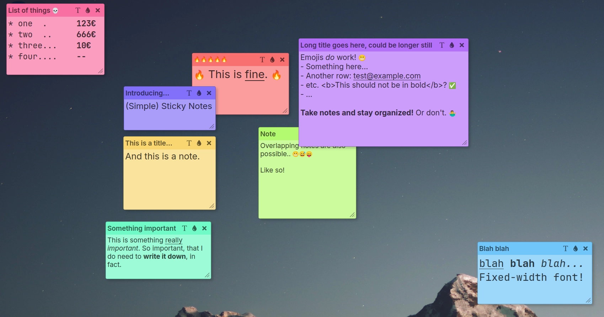
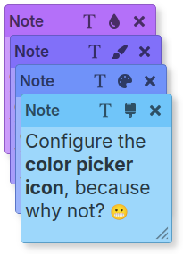
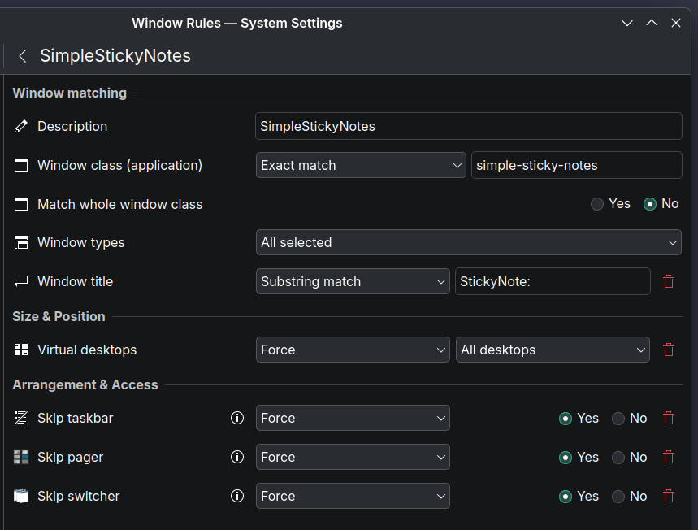

# (Simple) Sticky Notes
A quite simple sticky notes application, nothing more.

## Short origin story
This app was partially inspired by [**Linux Mint** Sticky](https://github.com/linuxmint/sticky); as I distro-hopped from Mint to **Fedora KDE** I found myself wanting a similar _sticky notes_ app, that would allow freeform note placement and, crucially, one click toggling of notes. I didn't find a suitable replacement so I decided to write one myself!



## Features


- Sticky notes of different colors, basic rich-text support (**bold**, _italic_, ~~strikethrough~~ and <ins>underline</ins>)
- Notes can have optional title (_double-click_ to edit)
- One click on the system tray icon to hide/show notes!
- Global font name & size can be set through the [config-file](#configuration-file)
	- Text size can be adjusted individually per sticky note as needed
	- Sticky notes can be set to use fixed-width/monospace font
- ✅ [Emoji-support](#emoji-support)
- Designed for **KDE**, however...
	- I ran into issues with note/window positioning on **Wayland** and ultimately ended up side-stepping the issue by running in **XWayland** 🫣
	- I _have_ some ideas on how to realise native Wayland support, but it remains to be seen if I can be bothered to try them.. 🤔
	- Also needs a _KDE Window Rule_ to avoid stickies from showing up in taskbar / task switcher (→ see [installation notes below](#kde-window-rule-or-how-to-avoid-stickies-being-all-over-the-taskbar); the app can do this automatically or user can configure the rule manually)
- _Seems_ to work in **X11**, too
	- Briefly tested in Linux Mint / Cinnamon (on X11)
- Notes are automatically backed up on app startup (10 most recent backups are kept by default)
- Written in **Python** using **PySide6**/**Qt**


## Install / setup notes
After cloning the code, you have two options.
1. You can install the **PySide6** packages for your system and use your system **Python** installation (which is likely already installed; install Python 3 if not) to run the app. This way the app menus follow your system theme.
	- For example on **Fedora**:  
	`sudo dnf install python3-pyside6` to install PySide.  
	
	  Then launch with:  
	`python3 /PATH/TO/simple-sticky-notes/simple_sticky_notes.py`
2. Alternatively, you can [setup a Python virtual environment](#setup-virtual-environment) that contains the Python-instance along with the dependencies. App menus look different as system theme is not usable.

### Setup virtual environment
Run these commands to create the virtual environment, activate it and install dependencies:
```
python3 -m venv .venv
source .venv/bin/activate
pip install --upgrade pip
pip install -r requirements.txt
```

### To launch the app:
Depends on whether you're using system libaries or the virtual environment. To launch...
- ...using system libraries: `python3 /PATH/TO/simple-sticky-notes/simple_sticky_notes.py`

- ...while within `.venv`-shell: `python3 simple_sticky_notes.py`
	- to exit `.venv`-shell: `deactivate`

- ...outside `.venv`, but using the Python-instance & libraries from inside the `.venv`:  
  ```
  /PATH/TO/simple-sticky-notes/.venv/bin/python3 /PATH/TO/simple-sticky-notes/simple_sticky_notes.py
  ```

To simplify things the app can be added to your system application launcher with a `.desktop`-file. Run the app as outlined above with `--install-desktop-file` once. After that you should find **(Simple) Sticky Notes** in your app launcher menus.

Optional: launch with `--help` to see other available command-line arguments, but they're not really needed for general usage.

### KDE Window rule, or: _how to avoid stickies being all over the taskbar?_
If your desktop is using **Wayland**, the sticky notes will likely show up as separate windows on the taskbar (because that's what they are, technically). For **X11**-based desktops, this is not relevant.

In any case, for proper UX, the stickies should be hidden from task switchers. Two options to do that (on **KDE**): manual setup or automatic setup.


#### Automatic setup:
On the first run, **(Simple) Sticky Notes** offers to add the window rule for you (by modifying `~/.config/kwinrulesrc`), unless it already exists. Accept and it should do the trick. Before changing anything, a backup is first made to `~/.config/kwinrulesrc.bak`. You can rerun the window rule check later with `--check-window-rule` command-line argument.

#### Manual setup:
Go to **KDE System Settings** → **Window Rules** and add select _"Import..."_ Pick the included `sticky_notes.kwinrule`. You can also manually add a new rule and configure it like below:
- Window class, exact match: `simple-sticky-notes`
- Window title, substring match: `StickyNote:`
- Virtual desktops: **Apply initially, All desktops** (this is optional)
- Skip taskbar: **Apply initially, Yes**
- Skip pager: **Apply initially, Yes**
- Skip switcher: **Apply initially, Yes**
- If _Apply initially_ doesn't seem to work, try _Force_. (When automatically adding the rule, _Force_ is used so that the changes are immediately in effect.)  


### Emoji-support
Emojis in notes will work, _if_ **Qt** has support for rendering using the configured font. See below on emoji font configuration. This app comes bundled with the [Noto Color Emoji](https://github.com/googlefonts/noto-emoji)-font, which is set to be preferred by default. Note that the newer Noto Emoji font (`Noto-COLRv1.ttf` that comes bundled with Fedora, for example) currently fails to render in **Qt** font engine. Other emoji fonts can be used by changing the configuration file, see below.


## Configuration file
After the first run, the configuration file is created at `~/.config/simple-sticky-notes/simple-sticky-notes.conf`. Here are the options explained:

|section | setting | default value | explanation|
|--------|---------|---------------|-----|
|**`[fonts]`** |  `font_name` |  _(empty)_ | Font family name to use for all texts, e.g. `Inter` or `Noto Sans`. Empty value means use the system default font.|
|| `font_size` | `-1` | Font point size, e.g. 14, `-1` means the system default. |
||`monospace_font_name`| _(empty)_ | Fixed-with/monospace font family name to use for notes that have fixed-width enabled. E.g. `Noto Sans Mono`. Empty value means use the system default monospace font.|
||`emoji_font_names`|`Noto Color Emoji, Segoe UI Emoji`| Comma-separated list of emoji font family names. Order matters, first found font is used. Note that Qt seems to have issues rendering some emoji fonts.|
|**`[notes]`**|`num_backups`|`10`|How many automatic backups to keep. Set to `0` to disable the automatic backups on startup.|
||`default_note_title`|`Note`|Default title for new notes. Can be left empty.|
||`color_icon_name`|`droplet`|Icon for the color picker: can be set to `brush`, `droplet`, `paintbrush` or `palette` for a different icon. (Only because I couldn't decide which icon is the best!)|
||`hide_on_startup`|`false`|Whether to hide notes on app startup. **NOTE:** Command-line argument `--stealth` or `-s` can also be used to force notes stay hidden, regardless of this setting.|


## TODO-list
List of potential changes to be made, or features to be added. No guarantees, though.
- [ ] Periodic autosave?
	- Or trigger save after typing / making changes (with some delay)
- [ ] Maybe detect URLs from notes and make them clickable
- [ ] Sets/groups of notes, one active at a time
- [x] **DONE:** Test whether "Force" is required for window rule, "Apply initially" seems to work fine
	- Seems to work, although automatic window rule method still uses "Force" to have the effect immediately visible
- [x] **DONE:** Write about making a `.desktop`-file
- [x] **DONE:** Make backup of notes at startup
- [x] **DONE:** Need to detect if notes are "dirty", prevent excess saving if nothing has changed
- [x] **DONE:** Note scrollbar should be styled to look nicer
- [x] **DONE:** Note text format menu should be styled to look nicer (custom style applied when ran inside `.venv`)
- [x] **DONE:** Better icon for resize-handle
- [x] **DONE:** Investigate automatic KWin rule setup
- [x] **DONE:** Fixed-width/monospace font option per sticky note
